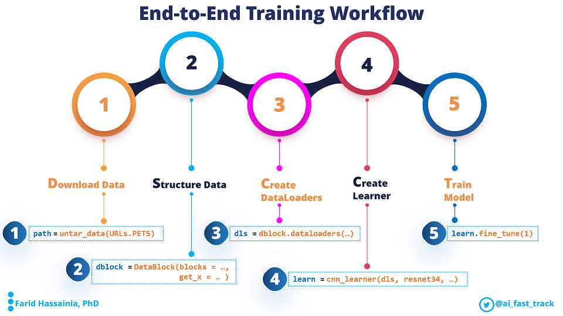

    
> **Note:**  
> If you find this work useful, please let other people know by **starring** it. Thank you!
    

# fastai 2 Visual Guide

A collection of notebooks supported by video animations explaining different concepts used in fastai2 library, in an intuitive way.

01_data_block_pet_tutorial.ipynb: end-to-end image classification using single label. Use-case: Oxford-IIIT-Pet dataset
 

# About AI Fast Track
Helping democratize AI / Deep Learning (DL). Breaking down complex concepts into easy to understand pieces.

Helping ease your AI / Deep Learning journey by providing intuitive tutorials on both state-of-the-art Neural Network Applications, and practical AI/DL productive tools for AI/DL practionners.

Happy Learning!

[twitter](https://twitter.com/ai_fast_track)
[YouTube Channel](https://www.youtube.com/channel/UCht9jVWkzlolBqWJ2tsskOQ)

